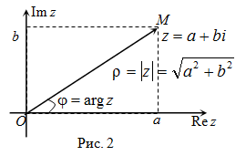

**Глава 0 Введение

Параграф 1, Комплексные числа

Опр. Упорядоченная пара (х,у) вещественных чисел х, н называется комплексным числом

(х1, н1) = ( х2, у2) <=> x1 = x2 и  y1 = y2

Введем операции сложения и умножения комлексных чисел

Для z1 = (x1;y1 и z2 = (x2;y2):

z1+z2 = (x1+x2;y1+y2)
z1*z2 = (x1*x2 - y1*y2); x1*y2+x2*y1)

*//
x = (x,0) - вещественное число
1 = (1,0) - единица
0 = (0,0) - нуль
(0, y) - чисто мнимое число
i = (0,1) - мнимая единица
//*

Тогда

z = (x,y) = (x, 0) + (0, y) = (x, 0) + (0, 1)*(y,0) = x + i*y
 - алгебраическая запись комлексного числа

С - множество комплексных чисел

<C,+,*,0,1> является полем.

Для z = x + iy:

z_ := x - iy - комплексно сопряженное к z число
x =: Re z - вещественная часть числа z
y =: Im z - мнимая часть числа я

abs(z) =def= sqrt(x^2 + y^2) - модуль комплексного числа z

Геометрическая интерпретация:

// + рисунок, как просиходит разделение полуплоскостей на четверти по движению как на тригонометрическом круге в школе
В полярных координатах:

z = r*cos(fi) = + i * r * sin(fi), где r = abs(z), fi = arg(z) - аргумент комлексного числа. arg(0) считаем неопреределенным!

жжжжж

Справедлива формула

(abs(z))^2 = z*z_ = x^2 + y^2

z1,z2 принадлежит C, z2 != 0

z1/z2 = z1*z2_/(abs(z2))^2 = (x1*x2 + y1*y2)/(x2^2+y2^2) + i * (x2y1 - x1y2) / (x2^2 + y2^2)

_______

Справедливы формулы:

abs(z_) = abs(z);
abs(z1*z2) = abs(z1)*abs(z2)
arg(z1)*arg(z2) = arg(z1) + arg(z2) + 2pim, arg (z1*z2) принадл (-pi, pi]
где m принадлежит {-1;0;1}

z in C , n in N, z = r(cos(fi) + i sin(fi))
z^n := z * ... * z (n раз) = r^n ( cos (n*fi) + i sin (n*fi)) ( k различных значений корня)

a := sqrt^n(z), если  a^n = z

sqrt^n(z) = sqrt^n(abs(z)) (cos ((arg z + 2 k pi)/n) + i sin ((arg z  + 2k pi)/n) - формула Муавра
0 <= k <= n-1

Важные неравенства треугольника

||z1| - |z2|| <= |z1 + z2| <= |z1| + |z2|

|z1 - z2| - расстояние между точками

________________________----

Поле комплексных чисел C изоморфного полю матриц вида

(x -y)  , (x, y in R)
(y  x)

E1 -fi-> E2 for all x,y in E1:
fi(x+y) = fi(x) + fi(y)
fi(x*y) = fi(x) * fi(y)

